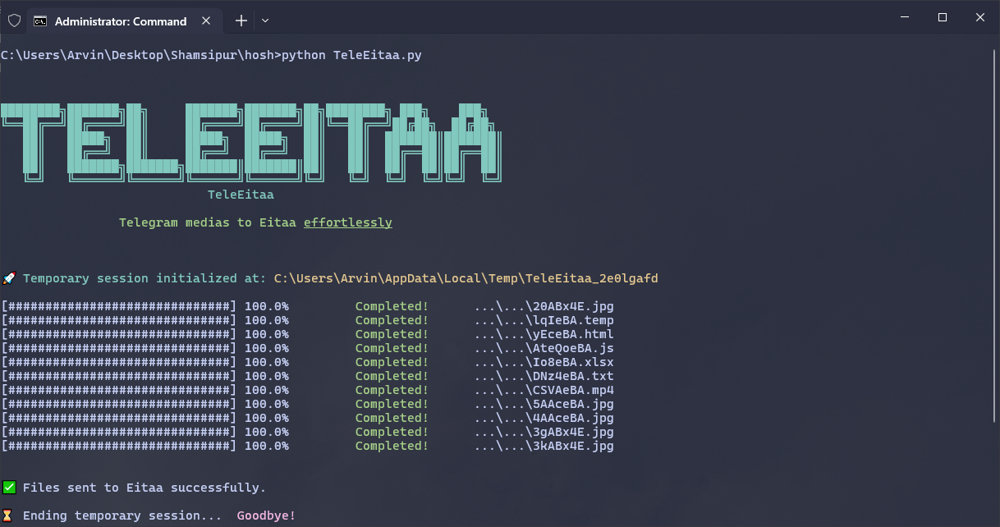

# **TeleEitaa**   
`TeleEitaa` is a Python-based script designed which download media from your Telegram account and upload it directly to Eitaa easily 🚀

<br/>

<p align="center">

</p>

<br/>

## **Features**  
- ✨ **User Friendly:** Stay updated with real-time colorful download progress.

- ✨ **Seamless Integration:** Connects to both Telegram and Eitaa using their APIs.

- ✨ **Temporary Session Management:** Files are handled in a secure, isolated temporary directory.

<br/>

## **Prerequisites**  
Before you dive into the magic of TeleEitaa, ensure you have the following:  
- **Python** 3.7+ installed.
- **Telegram Official API:**  
  - API_ID and API_HASH from [Telegram's Developer Portal](https://core.telegram.org/api/obtaining_api_id)
- **Eitaa Official API:**  
  - TOKEN and CHAT_ID from [Eitaayar](https://eitaayar.ir/register)
- **Proxy** for connecting to Telegram (If required in your region)

<br/>

## **Installation**  
Get started in no time! Just follow these steps:  

1. Clone the repository:  
   ```bash
   git clone https://github.com/amoAR/TelegramToEitaa.git
   cd TelegramToEitaa
   ```

2. Install dependencies:  
   ```bash
   pip install -r requirements.txt
   ```

3. Update the script with your credentials:  
   - Fill in the placeholders for `API_ID`, `API_HASH`, `TOKEN`, and `CHAT_ID` in the script.
   - Don't forget about proxy configuration.

4. Run the script:  
   ```bash
   python teleeitaa.py
   ```

<br/>

## **Usage**  
1. The script will download all media files from your Telegram **Saved Messages** chat.  
2. Files will then be uploaded to the specified Eitaa channel or group.  
3. Enjoy your media seamlessly transferred! 🌟  

<br/>

## **Known Limitations**  
- We can't upload media directly to Eitaa due to their API limitation.
- Currently, the script can't download Telegram media parallel.
- Large files may be subject to Telegram premium account.

<br/>

## **Credits**  
- [Pyrogram](https://github.com/pyrogram/pyrogram)
- [Eitaapykit](https://pypi.org/project/colorama/)

---

🔸 © 2024 amoAR | Licensed under the [GPL-3.0](https://github.com/amoAR/TelegramToEitaa/blob/main/LICENSE) license.
